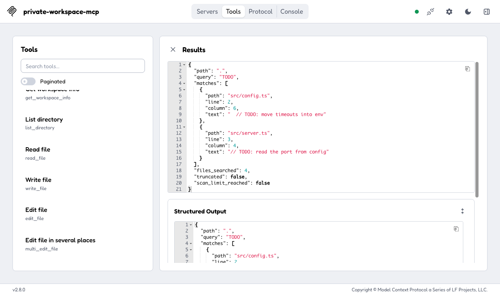
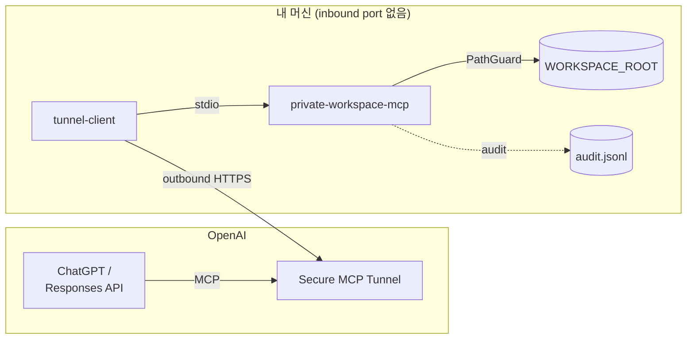
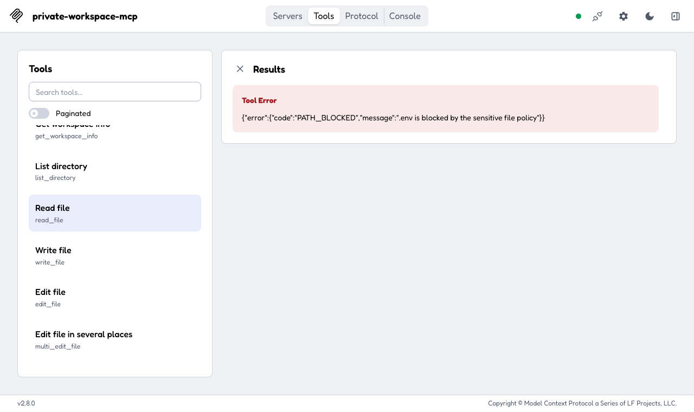

# Private Workspace MCP

[](https://github.com/psw7205/private-workspace-mcp/actions/workflows/ci.yml)
[](https://github.com/psw7205/private-workspace-mcp/releases)

[](LICENSE)

**내 머신의 project directory를 ChatGPT에 안전하게 연결하는 MCP 서버.** Claude Code처럼 stdio server를 직접 띄우는 MCP client에서도 같은 서버를 그대로 쓴다.

stdio 서버라서 public HTTP listener가 없다. ChatGPT에는 OpenAI Secure MCP Tunnel의 `tunnel-client`가 child process로 띄워 연결하고, 다른 MCP client는 tunnel 없이 같은 entry를 child로 실행한다. model에게는 workspace 안에서만 동작하는 작고 감사 가능한 filesystem tool을 주고, shell과 임의 process 실행은 주지 않는다.



## 특징

- **workspace 밖으로 못 나감**: root는 서버 설정으로만 정하고 realpath로 고정한다. `..`, 절대 경로, symlink 탈출은 `PATH_OUTSIDE_WORKSPACE`로 거부한다.
- **민감 파일 차단**: `.env`, `*.pem`, `.ssh`, `credentials*` 등은 읽기·쓰기가 `PATH_BLOCKED`로 거부되고, 목록·검색·Git 결과에서는 존재 여부도 드러내지 않고 빠진다. 기본 deny 목록은 설정으로 지울 수 없다. 이름이 평범해도 내용에 API key나 private key 형식 값이 든 파일은 읽기·편집·검색에서 막힌다.
- **기본 read-only, 쓰기는 revision 기반**: 기존 파일은 읽을 때 받은 `revision`이 맞아야만 atomic하게 교체한다. 그 사이 사람이 파일을 고쳤다면 `REVISION_CONFLICT`로 막는다.
- **적용 전 diff 확인**: `write_file`·`edit_file`·`multi_edit_file`의 `dry_run`은 쓰지 않고 unified diff만 돌려준다.
- **여러 repo를 tunnel 하나로**: `WORKSPACE_ROOTS=api=…,web=…`로 띄우고 repo별로 read-write를 따로 줄 수 있다.
- **Git은 opt-in read-only**: `WORKSPACE_GIT=read-only`면 `git_status`·`git_diff`·`git_log`·`git_show`가 켜진다. hook, filter, network는 모두 끈 채로 실행한다.
- **모든 호출을 audit**: tool call마다 JSON Lines 1건을 남기고, 파일 내용과 secret은 기록하지 않는다.

## 동작 구조



## 예시

demo fixture에 실제 서버를 띄우고 호출한 결과다(응답은 일부 줄임).

**TODO 찾기**: `search_text {"query": "TODO"}`

```json
{
  "matches": [
    { "path": "src/config.ts", "line": 2, "column": 6, "text": "  // TODO: move timeouts into env" },
    { "path": "src/server.ts", "line": 3, "column": 4, "text": "// TODO: read the port from config" }
  ],
  "files_searched": 4,
  "truncated": false
}
```

**고치기 전에 diff 보기**: `read_file`로 받은 `revision`을 넣고 `edit_file`을 `dry_run: true`로 호출한다.

```diff
--- a/src/server.ts
+++ b/src/server.ts
@@ -1,7 +1,7 @@
 import { createServer } from 'node:http';
 
 // TODO: read the port from config
-const PORT = 3000;
+const PORT = Number(process.env.PORT ?? 3000);
 
 createServer((req, res) => {
   res.end('ok');
```

**막히는 요청**: secret 파일과 workspace 밖 경로는 오류로 끝나고, message에 host 경로가 들어가지 않는다.

```jsonc
// read_file {"path": ".env"}
{ "error": { "code": "PATH_BLOCKED", "message": ".env is blocked by the sensitive file policy" } }

// read_file {"path": "../../etc/passwd"}
{ "error": { "code": "PATH_OUTSIDE_WORKSPACE", "message": "\"..\" segments are not allowed" } }
```

<details>
<summary>Inspector 화면: <code>.env</code> 읽기 거부</summary>



</details>

## 빠른 시작

전체 절차와 옵션은 **[시작하기 가이드](docs/getting-started.md)**에 있다.

**로컬에서 먼저 써 보기** (tunnel 없이 MCP Inspector로):

```sh
mise install && pnpm install --frozen-lockfile && pnpm build
npx @modelcontextprotocol/inspector -e WORKSPACE_ROOT="$PWD" -- node dist/index.js
```

**ChatGPT에 연결하기**:

1. **설치**: GitHub Release의 `index.mjs`를 받고 checksum과 attestation을 검증한다. → [설치](docs/getting-started.md#1-설치)
2. **설정 확인**: `WORKSPACE_ROOT=<project> node index.mjs --check`로 root와 mode를 확인한다. → [설정 확인](docs/getting-started.md#2-설정-확인)
3. **tunnel profile**: `tunnel-client init`으로 이 서버를 child command로 등록한다. → [profile](docs/getting-started.md#3-tunnel-profile-만들기)
4. **daemon 실행**: `tunnel-client run`을 띄운다. → [실행](docs/getting-started.md#4-daemon-실행)
5. **connector**: ChatGPT Developer mode에서 Tunnel connector를 **인증 없음**으로 추가한다. → [connector](docs/getting-started.md#5-chatgpt-connector-연결)

**다른 MCP client에서 쓰기**: 1~2번 뒤에 client 설정에 `node index.mjs`를 stdio server로 등록한다. tunnel은 필요 없다. → [다른 MCP client](docs/getting-started.md#다른-mcp-client에서-쓰기)

## Tools

| tool | 하는 일 | 쓰기 |
|------|---------|:----:|
| `get_workspace_info` | workspace 이름, mode, limit, 서버 version | |
| `list_directory` | directory 목록(depth 지정) | |
| `read_file` | UTF-8 파일 읽기(line pagination), `revision` 반환 | |
| `find_files` | glob으로 파일 찾기(`.gitignore` 존중) | |
| `search_text` | literal 또는 RE2 regex 검색 | |
| `write_file` | 파일 생성 또는 전체 교체, `dry_run` diff | ✓ |
| `edit_file` | exact-match 문자열 교체, `dry_run` diff | ✓ |
| `multi_edit_file` | 한 파일에 여러 edit를 atomic하게 적용 | ✓ |
| `git_status` · `git_diff` · `git_log` · `git_show` | read-only Git 조회(`WORKSPACE_GIT=read-only`일 때만) | |

인자, 반환값, error code, 환경 변수는 [reference](docs/reference.md)에 있다.

## 보안

path 검증은 defense-in-depth이고, 최종 경계는 전용 OS 사용자나 container 같은 OS 권한이다. read-write 모드에서는 파일에 심어진 prompt injection이 쓰기 호출로 이어질 수 있으므로 ChatGPT의 write 확인을 끄지 않고, 다른 client에서는 write tool 호출 전에 확인을 받는지 확인한 뒤에만 read-write를 켠다. 방어 계층, Git hardening, client 승인 설정은 [보안 모델](docs/security.md)에 있다.

## 문서

| 문서 | 내용 |
|------|------|
| [시작하기](docs/getting-started.md) | 설치, tunnel 연결, 다른 MCP client, 업그레이드, 여러 repo, container, 문제 해결 |
| [Reference](docs/reference.md) | tool 인자, error code, 환경 변수, CLI |
| [보안 모델](docs/security.md) | 방어 계층, Git hardening, prompt injection과 승인, 알려진 한계 |
| [PRD](docs/prd.md) · [ADR](docs/adr/) | 요구사항과 아키텍처 결정 |
| [Implementation notes](docs/implementation-notes.md) | PRD·ADR에 없던 세부 결정(M 항목) |

## 개발

개발 환경, 명령, 테스트 규칙, 릴리즈 절차, 코드 구조는 [`AGENTS.md`](AGENTS.md)에 있다. 사람과 coding agent가 같은 규칙을 따른다.

## License

[Apache-2.0](LICENSE)
