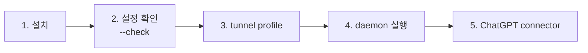

# 시작하기

내 머신의 project directory를 ChatGPT에 연결하는 전체 절차다.



- [준비물](#준비물)
- [먼저 로컬에서 써 보기](#먼저-로컬에서-써-보기) (선택)
- [1. 설치](#1-설치)
- [2. 설정 확인](#2-설정-확인)
- [3. tunnel profile 만들기](#3-tunnel-profile-만들기)
- [4. daemon 실행](#4-daemon-실행)
- [5. ChatGPT connector 연결](#5-chatgpt-connector-연결)
- [업그레이드와 rollback](#업그레이드와-rollback)
- [여러 repo와 여러 머신](#여러-repo와-여러-머신)
- [container로 격리하기](#container로-격리하기)
- [문제 해결](#문제-해결)

## 준비물

| 항목 | 용도 |
|------|------|
| Node 26 | 서버 실행. 예시는 [mise](https://mise.jdx.dev)로 설치한 node를 `$(mise which node)`로 가리킨다 |
| [`gh`](https://cli.github.com) | release 다운로드와 attestation 검증 |
| `tunnel-client` | OpenAI Secure MCP Tunnel client. `brew install openai/tools/tunnel-client` |
| OpenAI Platform의 tunnel ID와 runtime API key | Platform > Tunnels. admin key가 아니라 runtime key |
| agent 전용 directory | workspace root. filesystem root와 home은 거부된다 |

## 먼저 로컬에서 써 보기

tunnel 없이 [MCP Inspector](https://github.com/modelcontextprotocol/inspector)로 tool을 직접 호출해 볼 수 있다. source checkout에서 build한다.

```sh
mise install          # Node 26, pnpm (mise.toml)
pnpm install --frozen-lockfile
pnpm build
npx @modelcontextprotocol/inspector -e WORKSPACE_ROOT="$PWD" -- node dist/index.js
```

서버 환경 변수는 `-e`로 넘긴다. 기본은 read-only다. 쓰기 tool까지 보려면 `-e WORKSPACE_MODE=read-write`를, Git tool까지 보려면 `-e WORKSPACE_GIT=read-only`를 더한다.


## 1. 설치

daemon을 띄울 머신에는 GitHub Release의 `index.mjs` 하나만 설치한다. runtime dependency가 bundle에 들어 있어 Node 26 외에 source, pnpm, `node_modules`가 필요 없다. 버전마다 directory를 두고 `current` symlink로 가리킨다.

```sh
VERSION=v0.2.0
DIR="$HOME/.local/share/private-workspace-mcp"
mkdir -p "$DIR/$VERSION" && cd "$DIR/$VERSION"
gh release download "$VERSION" --repo psw7205/private-workspace-mcp
shasum -a 256 -c SHA256SUMS
gh attestation verify index.mjs --repo psw7205/private-workspace-mcp
ln -sfn "$VERSION" "$DIR/current"
$(mise which node) "$DIR/current/index.mjs" --version
```

- `gh attestation verify`는 파일이 이 repo의 release workflow에서 build됐는지 Sigstore 서명으로 확인한다. checksum만으로는 Release asset이 바뀐 경우를 막지 못한다.
- bundle은 minify하지 않는다. release된 파일을 그대로 읽고 감사할 수 있다.
- source를 build해 쓰려면 아래 `<entry>` 자리에 repo의 `dist/index.js`를 넣고, 업그레이드할 때 `pnpm build`를 다시 한다.

아래에서 쓰는 자리표시자:

| 자리표시자 | 값 |
|-----------|-----|
| `<entry>` | release 설치면 `$HOME/.local/share/private-workspace-mcp/current/index.mjs`, source build면 repo의 `dist/index.js` 절대 경로 |
| `<project>` | agent 전용 directory의 절대 경로(filesystem root와 home은 거부됨) |
| `<audit-dir>` | workspace 밖의 기존 directory. 빼면 audit은 `tunnel-client` 로그로 간다 |

## 2. 설정 확인

profile에 넣을 env와 entry 그대로 `--check`를 실행한다. 서버를 띄우지 않고 startup과 같은 검증만 한 뒤, 해석된 workspace root(canonical 경로)와 mode, limit, audit 출력처를 stderr에 요약한다. 설정이 틀리면 startup과 같은 오류를 내고 exit 1이다. audit file은 만들지 않는다.

```sh
env WORKSPACE_ROOT=<project> WORKSPACE_MODE=read-write WORKSPACE_AUDIT_LOG=<audit-dir>/audit.jsonl $(mise which node) <entry> --check
```

node는 `$(mise which node)`로 절대 경로를 넣는다. `tunnel-client`를 띄우는 shell에 mise가 활성화돼 있지 않으면 PATH의 `node`가 Node 26이 아닐 수 있다. 모든 설정은 [`reference.md`](reference.md#환경-변수)에 있다.

## 3. tunnel profile 만들기

tunnel ID와 runtime API key는 source checkout의 `.env`에 둔다. `.env`는 git에 올라가지 않는다.

```sh
cp .env.example .env    # TUNNEL_ID, API_KEY 입력
```

profile은 한 번만 만든다. profile은 `~/.config/tunnel-client/`에 머신별로 저장되고 절대 경로가 들어가므로 git으로 옮겨지지 않는다.

```sh
set -a && . ./.env && set +a
tunnel-client init --sample sample_mcp_stdio_local --profile workspace-mcp \
  --tunnel-id "$TUNNEL_ID" \
  --mcp-command "env -u CONTROL_PLANE_API_KEY -u OPENAI_API_KEY WORKSPACE_ROOT=<project> WORKSPACE_MODE=read-write WORKSPACE_AUDIT_LOG=<audit-dir>/audit.jsonl $(mise which node) <entry>"
```

- child는 `tunnel-client`의 환경 변수를 상속하고, child의 stderr는 `tunnel-client` 로그로 전달된다(`tunnel-client` 0.0.14에서 확인). 그래서 서버 설정은 command에 명시하고, `env -u`로 runtime key를 child에 넘기지 않는다.
- 경로와 mode를 바꾸려면 `tunnel-client profiles edit workspace-mcp`로 고친다. 고칠 때도 같은 env로 `--check`를 먼저 돌린다.

## 4. daemon 실행

실행할 때마다 `.env`의 `API_KEY`를 `CONTROL_PLANE_API_KEY`로 넘긴다. subshell에서 원래 이름을 지우므로 child에는 key가 전달되지 않는다.

```sh
( set -a && . ./.env && set +a
  export CONTROL_PLANE_API_KEY="$API_KEY"
  unset TUNNEL_ID API_KEY
  tunnel-client doctor --profile workspace-mcp --explain && exec tunnel-client run --profile workspace-mcp )
```

- tunnel ID는 `init`이 profile에 적어 두므로 넘기지 않는다. `tunnel-client` 설정 우선순위는 flags > 환경 변수 > profile YAML이라 `CONTROL_PLANE_TUNNEL_ID`를 export하면 profile의 `tunnel_id`를 덮어쓴다.
- `run`이 떠 있는 동안에만 ChatGPT가 tool을 호출할 수 있다. 상태는 `http://127.0.0.1:8080/ui`와 `/readyz`로 본다.

## 5. ChatGPT connector 연결

`run`이 healthy인 동안 ChatGPT에서 connector를 만든다.

1. Settings > Security and login에서 Developer mode를 켠다.
2. https://chatgpt.com/plugins 에서 새 connector를 추가하고 Connection으로 Tunnel을 골라 tunnel을 선택한다(또는 `tunnel_id` 입력).
3. 인증은 **인증 없음(No authentication)**을 고른다. 이 서버는 OAuth를 구현하지 않으므로 OAuth를 고르면 "does not implement OAuth" 오류가 난다. 접근 통제는 OpenAI의 tunnel 권한이 맡는다(ADR 17 Amendment).
4. tool 8개(`WORKSPACE_GIT=read-only`면 12개)가 발견되는지 확인한다.
5. 새 대화에서 "workspace 정보를 보여줘"처럼 물어 `get_workspace_info`가 호출되는지 본다.

write tool 호출 확인은 끄지 않는다([`security.md`](security.md#prompt-injection과-client-승인)).

Responses API에서는 `tools: [{"type": "mcp", "server_label": "private_workspace", "tunnel_id": "tunnel_..."}]`로 같은 tunnel을 쓸 수 있다(`server_url`은 쓰지 않음).

## 업그레이드와 rollback

connector는 daemon이 아니라 `tunnel_id`에 묶인다. daemon을 다시 띄우거나 머신을 재부팅해도 connector를 다시 만들 필요가 없다.

1. [1. 설치](#1-설치)와 같은 방법으로 새 버전을 받아 `current`를 바꾼다(source build면 `pnpm build`). profile은 고치지 않는다.
2. profile의 `--mcp-command`와 같은 env로 `$(mise which node) "$DIR/current/index.mjs" --check`가 통과하는지 확인하고 daemon을 다시 띄운다. 내부 동작만 바뀌었으면 여기까지다.
3. tool 목록, description, schema가 바뀌었으면 https://chatgpt.com/plugins 에서 connection을 열고 Refresh를 누른다.
4. 새 대화를 시작한다. 기존 대화에는 이전 tool 목록이 남을 수 있다.

rollback은 `current`를 이전 버전으로 되돌리면 된다.

## 여러 repo와 여러 머신

- **한 tunnel에 instance 하나**: tunnel ID 하나에는 `tunnel-client` instance 하나만 실행한다. stdio child가 instance마다 따로 뜨기 때문이다.
- **한 머신의 repo 여러 개**: tunnel 하나로 노출한다. `--mcp-command`의 `WORKSPACE_ROOT=<project>`를 `WORKSPACE_ROOTS=api=<repo-a>,web=<repo-b>`로 바꾸면 child 하나가 모든 repo를 다루고 model은 tool 인자 `workspace`로 repo를 고른다(ADR-008). repo를 더하거나 빼면 tool schema가 바뀌므로 daemon을 다시 띄우고 connector를 Refresh한다. 이 tunnel을 쓸 수 있는 사용자는 모든 repo에 접근한다.
- **repo마다 다른 mode**: `WORKSPACE_MODE=read-write` 대신 `WORKSPACE_READ_WRITE=api`처럼 이름을 나열한다. 나머지 repo는 read-only이고 `write_file`·`edit_file`·`multi_edit_file` description에 쓰기 가능한 이름이 적힌다. `WORKSPACE_READ_WRITE`는 `WORKSPACE_MODE`와 함께 쓸 수 없으므로 `WORKSPACE_MODE=read-write`는 지운다.
- **tunnel을 나눌 때**: tunnel, profile, daemon, connector는 접근할 사람이나 용도가 달라야 할 때, 또는 read/write limit·timeout·추가 deny pattern처럼 서버 전체에 걸리는 설정이 repo마다 달라야 할 때만 따로 둔다. profile마다 `health.listen_addr` port(`8080`, `8081`, …)와 `WORKSPACE_AUDIT_LOG` 파일을 다르게 하고, 실행 명령의 `--profile`만 바꾼다. `tunnel-client`의 channel별 command(`--mcp.command channel=...`)는 OpenAI 쪽에서 channel을 고를 수단이 없어 쓰지 않는다.
- **공통 상위 directory는 root로 쓰지 않는다**: 다른 repo까지 노출되고, root 밖을 가리키는 symlink는 `PATH_OUTSIDE_WORKSPACE`로 거부된다.
- **여러 머신**: 머신마다 tunnel과 connector를 따로 만든다. 같은 tunnel을 여러 머신에서 쓰려면 한 번에 한 머신에서만 daemon을 띄운다. 이때 connector는 그대로 쓸 수 있지만, 연결되는 workspace는 그 머신 profile의 `WORKSPACE_ROOT`(또는 `WORKSPACE_ROOTS`)다.

## container로 격리하기

OS 권한 경계(ADR-001 §11)가 필요하면 child를 container로 띄운다. container에는 workspace와 audit log directory만 mount되므로 PathGuard에 결함이 있어도 host의 다른 파일에 닿지 않는다. `-i`는 필수이고 `-t`는 쓰지 않는다(stdout이 MCP channel).

```sh
--mcp-command "env -u CONTROL_PLANE_API_KEY -u OPENAI_API_KEY docker run -i --rm --network none --read-only -u 12345:12345 \
  -v <repo>:/app:ro -v <project>:/workspace -v <audit-dir>:/logs \
  -e WORKSPACE_ROOT=/workspace -e WORKSPACE_MODE=read-write -e WORKSPACE_AUDIT_LOG=/logs/audit.jsonl \
  node:26-bookworm node /app/dist/index.js"
```

- `<repo>`는 `pnpm install`과 `pnpm build`를 마친 이 repo다.
- Linux host에서는 `-u`로 준 uid가 `<project>`의 파일을 읽고 쓸 수 있어야 하고, 새 파일은 그 uid 소유로 생긴다(Docker Desktop for Mac은 host 사용자로 매핑한다).
- `WORKSPACE_ROOTS`를 쓰면 repo마다 `-v <repo-a>:/workspaces/api`처럼 mount하고 `-e WORKSPACE_ROOTS=api=/workspaces/api,web=/workspaces/web`을 준다.
- `docker run` 단독 stdio 호출은 확인했지만 `tunnel-client` 경유는 아직 확인하지 않았다(implementation notes 6절).

## 문제 해결

| 증상 | 원인과 해결 |
|------|------------|
| connector 생성 시 "does not implement OAuth" | 인증을 **인증 없음**으로 고른다 |
| 서버 업그레이드 뒤에도 옛 tool 목록이 보임 | connector Refresh 후 새 대화를 시작한다 |
| 한동안 되다가 ChatGPT 요청이 모두 실패 | MCP SDK `serveStdio`는 stdio connection을 **첫 요청의 protocol era**로 pin한다. OpenAI hosted 경로는 `2026-07-28`(modern)로 요청하는 것을 관측했다. 같은 `tunnel-client`에 2025-era(legacy) client를 먼저 붙이면 이후 OpenAI 요청이 실패하므로 `tunnel-client`를 재시작한다(implementation notes 4절) |
| 다른 profile의 tunnel로 연결됨 | `CONTROL_PLANE_TUNNEL_ID`가 export되어 profile의 `tunnel_id`를 덮어쓰고 있다. unset한다 |
| 이름이 평범한 파일(`backup.json` 등)이 `PATH_BLOCKED` | 내용에 API key나 private key 형식 값이 있어 내용 검사(ADR-010)에 걸렸다. audit의 `error_detail`이 `content:<pattern id>`다. secret이면 파일을 workspace 밖으로 옮긴다. 문서의 예제 값 같은 오탐이면 `WORKSPACE_CONTENT_SCAN=off`로 끌 수 있지만 서버 전체에서 꺼진다 |
| startup이 exit 1로 끝남 | stderr의 이유를 본다. `--check`로 같은 검증을 반복할 수 있다 |
